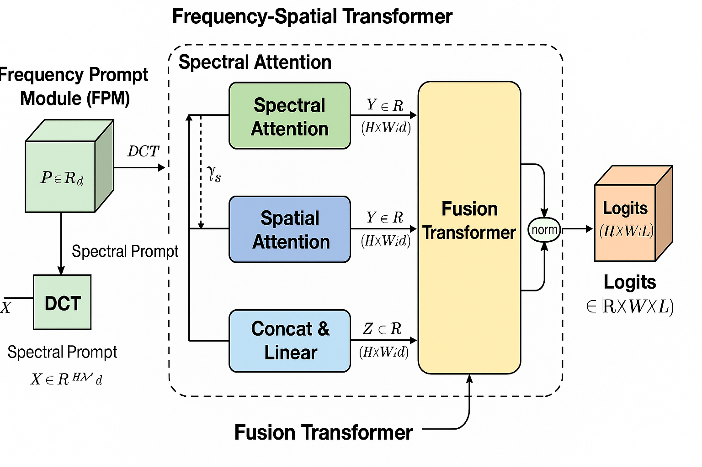

# 🛰️ Frequency-Prompt Guided Spectral–Spatial Transformer (FPGSST)
**_A Deep Transformer-based Approach for Hyperspectral Image Classification_**

---

## 🌍 Overview

This repository contains the implementation of the paper-inspired model **FPGSST (Frequency-Prompt Guided Spectral–Spatial Transformer)** for **Hyperspectral Image Classification (HSI)**.  
The model integrates **frequency-domain prompting**, **spectral-spatial attention**, and **transformer-based fusion** to achieve superior accuracy on benchmark HSI datasets.

The project supports training, evaluation, and visualization across multiple datasets:
- **Pavia University (PaviaU)**
- **HyRANK (Loukia)**
- **WHU-Hi LongKou**

---

## 🧠 Key Features
✅ Transformer-based architecture for spectral–spatial learning  
✅ Frequency-domain prompting for enhanced spectral discrimination  
✅ Modular design — supports multiple datasets and models  
✅ End-to-end training and evaluation pipeline  
✅ TensorBoard support for tracking training progress  
✅ Visualization tools for classification maps and performance comparison  

---

## 📂 Project Structure
hyperspectral-project/
├── datasets/ # Preprocessed HSI datasets (.mat, .npz)
├── models/ # Model architectures (FPGSST, HybridSN, etc.)
├── modules/ # Core modules (Attention, Augmentation)
├── preprocess/ # Data preprocessing scripts
├── experiments/ # Trained models and logs
├── results/ # Confusion matrices, performance plots, prediction maps
├── train.py # Main training script
├── evaluate.py # Evaluation and metrics
├── save_pred_map_full.py # Generate full HSI prediction maps
├── visualize_results.py # Generate final classification map figures
└── plot_results.py # Compare OA, AA, and Kappa across datasets
--

## 🧾 Requirements
Install all dependencies in your conda environment:
```bash
conda create -n hyper python=3.9
conda activate hyper
pip install torch torchvision torchaudio matplotlib numpy scipy scikit-learn tqdm tensorboard
python -c "import torch; print('CUDA:', torch.cuda.is_available())"
CUDA_VISIBLE_DEVICES=0 python train.py --dataset PaviaU --model FPGSST --bs 64 --epochs 30 --out experiments
python run_all_datasets.py
#Evaluate trained models and generate metrics:
python evaluate.py --npz datasets/PaviaU/PaviaU_preprocessed.npz \
                   --ckpt experiments/PaviaU/FPGSST/FPGSST_best.pth \
                   --model FPGSST
#Generate full-resolution classification maps:
python save_pred_map_full.py --dataset PaviaU \
  --ckpt experiments/PaviaU/FPGSST/FPGSST_best.pth \
  --patch 9 --batch 1024 --device cuda --out results
#Generate visual comparison of results:
python visualize_results.py
python plot_results.py
```
Outputs:

results/dataset_comparison.png

results/individual_results/ (per-dataset accuracy plots)

results/confusion_matrix_*.png

📊 Example Results
| Dataset         | OA (%) | AA (%) | Kappa  |
| --------------- | ------ | ------ | ------ |
| PaviaU          | 94.26  | 95.44  | 0.9251 |
| Loukia (HyRANK) | 41.20  | 20.03  | 0.2145 |
| WHU-Hi LongKou  | 33.94  | 22.13  | 0.2523 |

🧩 Model Architecture
<p align="center">  </p>

FPGSST Architecture:

Spectral–Spatial Transformer backbone

Frequency Prompt Module (FPM) — extracts DCT-based spectral prompts

Dual-branch attention (Spectral & Spatial)

Fusion Transformer for joint feature learning

🧠 Citation
If you use this work, please cite:
@misc{yaswanthasu2025fpgsst,
  title={Frequency-Prompt Guided Spectral–Spatial Transformer for Hyperspectral Image Classification},
  author={Yaswanthasu, A.Y.V. Trinadh},
  year={2025},
  publisher={GitHub},
  journal={https://github.com/Yaswanthasu/hyperspectral-fpgsst}
}
Here’s the architecture diagram for the Frequency-Prompt Guided Spectral–Spatial Transformer (FPGSST):
<p align="center">
  
</p>

